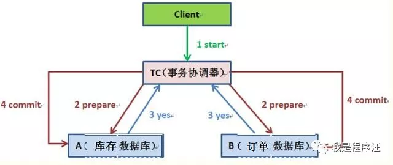
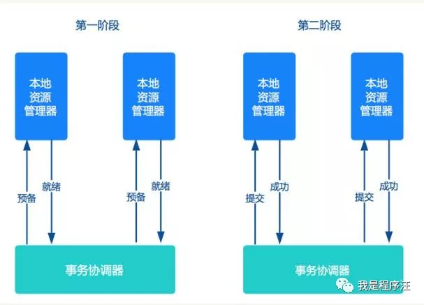
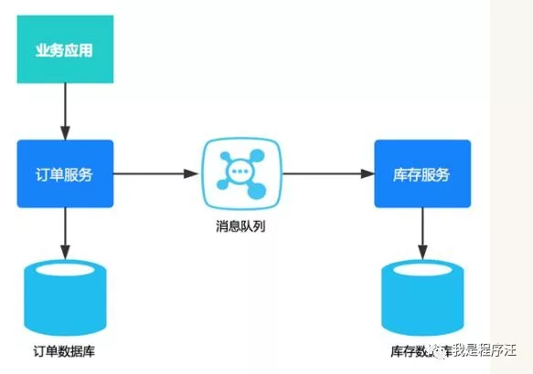
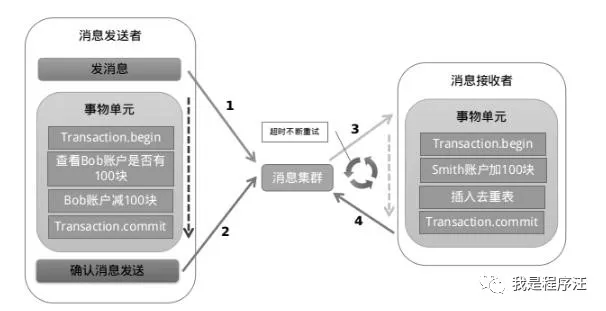
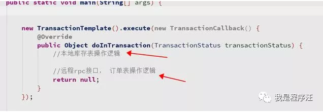
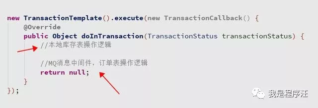

## 面试官：分布式事务讲下 程序员：不清楚 然后结果就凉凉了分布式事务应该是面试官最喜欢问的题目之一

我对分布式事务的基本思路整理总结了一下，其实还有很多细节没研究。

------

**基础知识准备**

- 数据库事务、分布式、微服务、分库分表

- 数据库事务的特性：原子性(Atomicity )、一致性( Consistency )、隔离性或独立性( Isolation)和持久性(Durabilily)，简称就是ACID

- 上面基础都不清楚，建议先把这些知识熟悉后在研究分布式事务。

  

  

------

**面试官:为什么有分布式事务**

由于业务数据量非常巨大，如淘宝电商系统，后端肯定是**分库分表**的。因为单个数据库数据量压上来，系统就会产生性能瓶颈。

库存和订单分别在不同数据库中。

交易系统、库存系统、订单系统。【微服务架构中，像淘宝光一个下单链路可能会涉及10多个系统以上】

如果下订单失败库存系统必须回滚数据，保证数据强一致性。

# 分布式事务种类

1. 数据库的2PC（两阶段提交）又叫做 XA Transactions，**强一致性、性能不高**
2. 补偿事务（TCC），记住3个单词 try、confirm、cancel，**逻辑简单**
3. 消息事务,最终一致性，**性能好**

# 2PC（两阶段提交）

2阶段提交是分布式事务传统解决方案，目测银行保险都喜欢用这个。

当事务跨越多个节点时，为了保持事务ACID，引入了协调者、参与者

- 第一阶段：事务协调器要求每个涉及到事务的数据库预提交(precommit)此操作，并反映是否可以提交.
- 第二阶段：事务协调器要求每个数据库提交数据。

------

**把下面图理解到位了，2PC模式的思路就理解了**

- 协调者=事务协调器、参与者=本地资源管理器
- 预备-提交

- 

- 缺点：**2PC效率很低，对高并发很不友好**

- 两阶段提交涉及多次节点的网络通信，导致通信时间过长。

- 非常容易造成长事务，锁定资源时间太长，资源等待时间增多。

- 大部分高并发场景都应该避免使用。

  

------

**补偿事务TCC**

#  

1. **Try** 阶段，对业务系统做检测和资源预留
2. **Confirm** 阶段对业务系统做确认提交，默认：Try执行成功，Confirm一定成功
3. **Cancel** 阶段在业务执行失败，需要回滚的情况下执行的业务取消，预留资源释放。

**举例**

1. Try 减库存
2. Confirm 更新订单
3. 如果更新订单失败，就进入Cancel阶段 恢复库存，回滚阶段是业务编码来实现的（一个sql把库存更新回去）,不同业务场景需要不同的**补偿代码**，复用性差。

- 缺点：对应用侵入性强、实现难度大
- 优点：降低锁冲突、提高吞吐量成为可能，灵活自定义数据库操作的粒度

# 

------

**消息事务**

思路：将本地事务和消息中间件放在一个事务中。

保证最终一致性，过程不能保证

- 将分布式事务转换为**两个本地事务**
- 然后依靠下游业务的**重试机制**达到最终一致性

缺点：基于消息的最终一致性方案应用对应用侵入性高，需要大量业务改造成本高

# 分布式事务异常情况

下面这些异常，都需要考虑 (程序汪提醒，这些异常情况面试时能回答出解决方案必须加分)

- 机器宕机
- 网络超时
- 消息丢失
- 数据错误
- 消息乱序
- 存储数据丢失
- 失败消息重试
- 等等其他异常

# 伪分布式事务

- 优点：不在高并发情况下，效果还是很好的代码逻辑也非常简单，一般情况下够用了。
- 缺点：高并发情况下容易成为一个**长事务**，网络可能延迟，导致数据库压力非常大。远程rpc有可能执行成功，但返回失败。

例子：数据不一致情况

当远程接口rpc执行成功，但超时返回异常，导致事务回滚而订单表却执行成功了。

# 消息事务的代码案例

# 总结

1. 全过程的强一致性：两阶段提交
2. 最终结果一致性：补偿事务