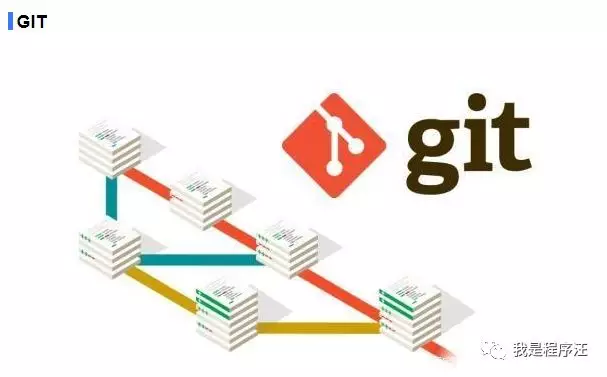

一般真做过互联网项目的朋友肯定接触过git

然后很多培训机构出来的朋友，都冒充两三年互联网项目开发经验

其实是0工作经验


培训机构现状

有些培训机构比较走心，还跟学生讲下svn、git 

但有些培训机构代码都是靠U盘copy来copy去的，

这一点都不夸张，

这样的培训机构我建议不用去了。


因此判断一个程序员是不是培训机构出来的，一个简单的问题svn、git玩过吗，有遇到过什么问题。（回答不了肯定就暴露了）


**场景回放**

程序汪：git用过吗

冒充3年互联网开发：用过的（心很虚的回答）

程序汪：那你讲下git合代码一般怎么操作，遇到冲突又怎么办？

冒充3年互联网开发：不清楚，没遇到过啊（暴露了）


下面我们来简单看下，其实非常简单的，把命令收藏下

下次用的时候拿出来看看就可以

思路一定要清楚




互联网公司大部分都用git去管理项目代码

特别是多团队协作开发的大项目

git的威力就出来了

分布式，多人开发，版本迭代比较快的项目，建议使用git。


**程序员最痛苦的是git合代码遇到一大堆冲突**


注意

git_项目版本编号  就是你项目拉的分支流编号  


思路很简单    1 把你当前分支 copy出一个临时分支出来

​                     2 临时分支和master 合并下 ，有冲突请解决掉(比较耗时的就是这一步)

​                     3 把临时分支合会当前开发分支 （这时候肯定没冲突了）

​                     4 把当前开发分支合到master


具体解决冲突命令

   ```
1 基于待合并的迭代分支  checkout 新分支 merge_master
git checkout master
git pull -p

2 执行 git merge master 并解决冲突
git checkout git_项目版本编号

git checkout -b merge_master-for-git_项目版本编号    【分支克隆】
 
git merge master   【执行这步会更新很多代码下来，有冲突就要解决,需要手动解决掉，确认不要覆盖代码】
  
3.push merge_master-for- 分支 
git push origin merge_master-for-git_项目版本编号

4.最后合会分支 git_项目版本编号

git checkout git_项目版本编号

git merge merge_master-for-git_项目版本编号

git push origin git_项目版本编号
   ```

最后一步是把当前分支合到master （很多大公司都是页面上触发即可）

持续集成


切记互联网公司合代码都是用  merge


git很牛逼，我建议大家会用会解决常见问题就可以，深入研究需要大量精力的。


学习网站推荐

https://git-scm.com/     git官网


https://www.liaoxuefeng.com/wiki/896043488029600  

### Git教程 - 廖雪峰的官方网站


https://www.runoob.com/git/git-tutorial.html