程序汪祝福大家情人节快乐（单身狗的早点找到对象）

在hash开头集合的世界里hashCode和equals就是情侣（本来没关系的），一起来完成集合元素是否重复判断的工作，当然还有其他工作 （单身狗受伤了，今天是情人节啊）

# **面试官们很喜欢问这个**

- java version 1.8【注意版本】
- hashCode()的作用是什么？
- 散列码是用来干什么？
- 为什么有hashCode必须要equals?
- 为什么散列表需要散列码呢？

# **吐槽**

面试官：说下Java中hashCode作用

程序员：这个（已经慌了，背的理论早忘记了）

面试官：好的，你可以回去等消息了

# hashCode（）方法

- 返回对象的哈希代码值（就是散列码），用来支持哈希表，例如：HashMap
- 可以提高哈希表的性能
- 先看下Object源码的hashCode方法

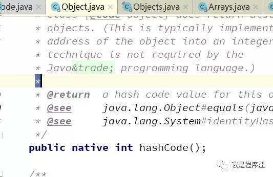

源码注释特别长，我大概总结下，像Hash开头的类，HashMap、HashSet、Hash等等

哈希代码值可以提高性能

实现了hashCode一定要实现equals，因为底层HashMap就是通过这2个方法判断重复对象的

# 绕口令式hashCode与equals

1. 如果两对象equals()是true,那么它们的hashCode()值一定相等

2. 如果两对象的hashCode()值相等，它们的equals不一定相等（hash冲突啦）

   

   

# 代码案例

理论我反正看的头疼，还是上代码来理解下吧

老规矩idea生动生成

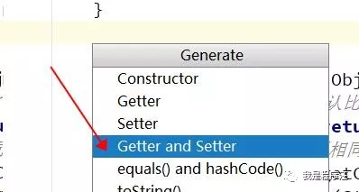

注释很详情

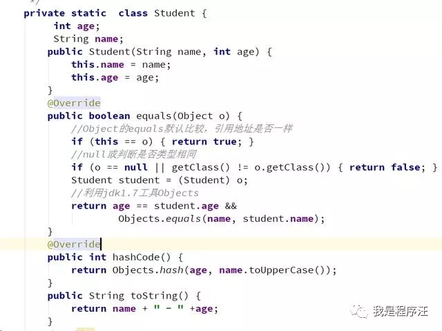

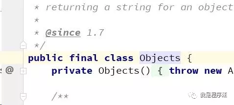

# main运行

注释很清楚了，HashSet去重是怎么判断的

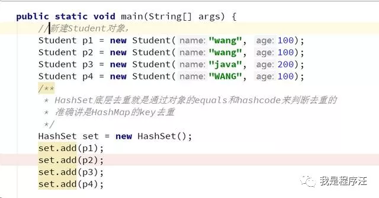

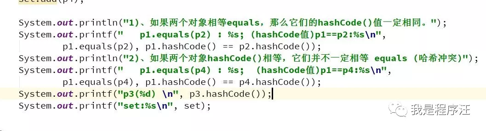

# 运行结果

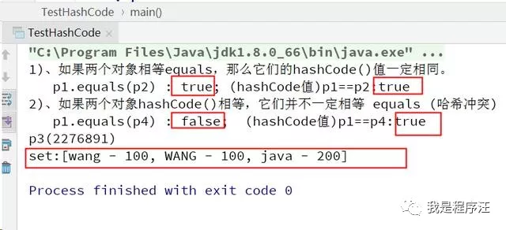

如果缺少hashCode或equals方法

输出结果（不会去重）

set:[wang - 100, wang - 100, WANG - 100, java - 200]

# Hash性能分析

HashSet是不允许有重复元素的

场景：HashSet存入10万数据，当add第10万零1个元素的时候，

底层源码可不是一个个遍历去判断重复元素，

是通过hash值去判断的

源码

HashSet

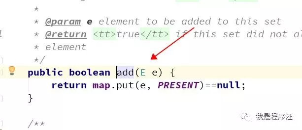

已经到HashMap了

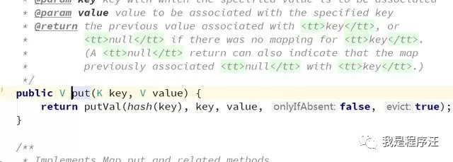

通过对象的hashCode()方法计算出哈希值

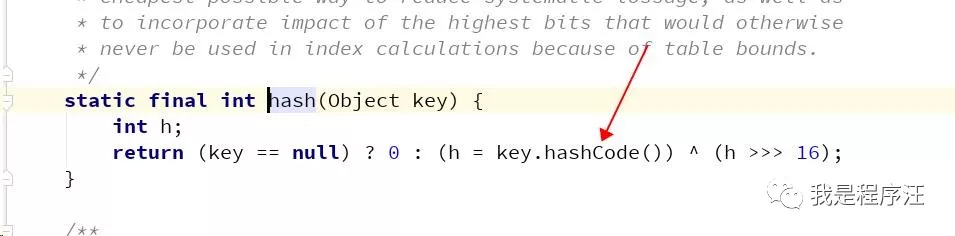

- 核心代码，见注释

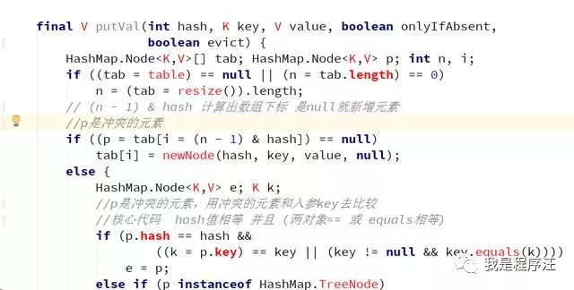

源码非常复杂，我也是利用idea工具，把变量值放到

下面New Watch里面，整个数据情况就出来了

- 1：先tab数组下标判断是否null
- 2：然后hash值 、equals值等比较

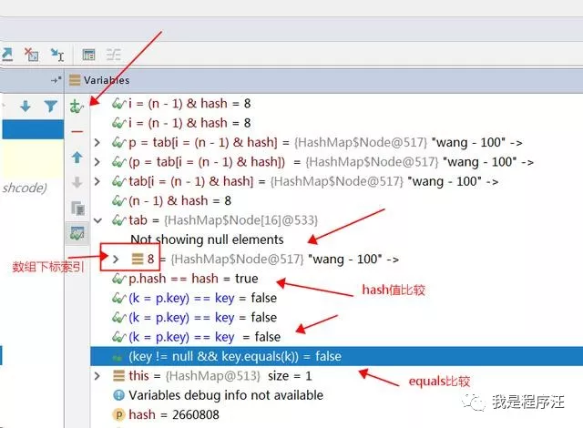

# 总结

1. **hashCode() 在散列表中才有用，在其它情况下没用**
2. 哈希值冲突了场景，hashCode相等，但equals不等
3. hashcode：计算键的hashcode作为存储键信息的数组下标用于查找键对象的存储位置
4. equals：HashMap使用equals()判断当前的键是否与表中存在的键相同。