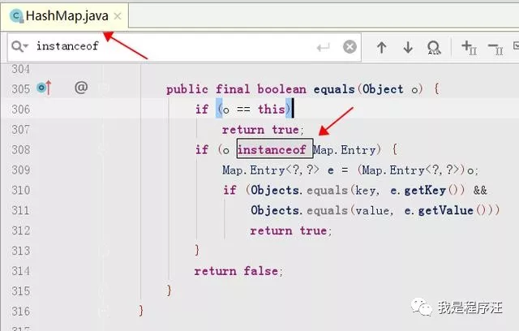
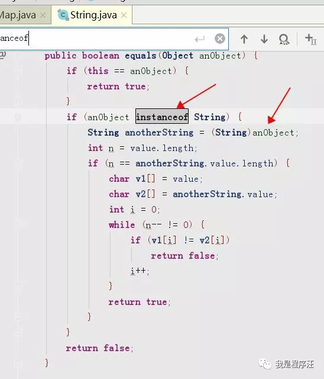
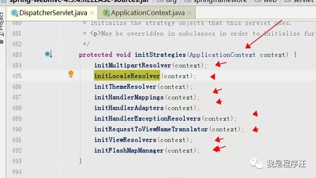
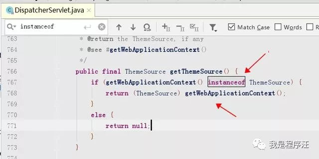

# **吐槽**

面试官：Java的向上转型和向下转型解释下

程序汪：我知道怎么用，不知道为啥哦

面试官：你可以回家等消息了

程序汪：凉凉的感觉

# **基础准备**

# 

1. **动态绑定**
2. 继承
3. 接口
4. 强制转换
5. **父类引用指向子类实现**

# **继承**


Java里继承是代码复用的机制，子类继承了父类的非私有属性和方法，然后子类又可以继续扩展自己的属性及方法。

# **向上转型（自动）**

# 

子类对象转为父类，父类可以是接口。

公式：Father f = new Son();Father是父类或接口，son是子类。

通俗讲：儿子升级变老子了，就只能用老子的方法了，儿子的方法就不能调用了，你要调用JVM老大会报错给你看，哈哈哈

老子就一个，儿子可以有很多。

# **向下转型（强制）**

# 

强制转换 必须 **（类型）父类**

父类对象转为子类。公式：Son s = (Son)f;

向下转型需要考虑安全性，如果父类引用的对象是父类本身，那么在向下转型的过程中是不安全的，编译不会出错，但是运行时会出现java.lang.ClassCastException错误。它可以使用instanceof来避免出错此类错误即能否向下转型，只有先经过向上转型的对象才能继续向下转型。

通俗讲：老子如果想变儿子，需要用instanceof安全验证下，不然有可能异常（不是亲生的就惨了）ClassCastException，**注意只有儿子升级到老子，然后老子才能降级到儿子**。

HashMap源码的向下转型



String源码里的向下转型





```

```

**SpringMVC源码（向上转型）**


#  

向下转型经典代码

方法入参是 接口ApplicationContext，具体初始化类在不用的init方法中

org.springframework.web.servlet.DispatcherServlet

**如果不用接口，直接用子类入参，这个代码会有多臃肿啊，那画面不敢想啊。**




# SpringMVC源码的向下转型



# 

# **吐槽**

java干嘛搞个向上向下转型，这么麻烦直接Son s = new Son()不是很爽嘛，

这就是复杂业务代码没遇到过才这么问

# **总结**

- 向上转型的作用，减少重复代码，**父类为参数**，调有时用子类作为参数，就是利用了向上转型。这样使代码变得简洁。体现了JAVA的抽象编程思想
- 框架代码中骨架代码都是靠向上向下转型来让代码复用达到极致；

