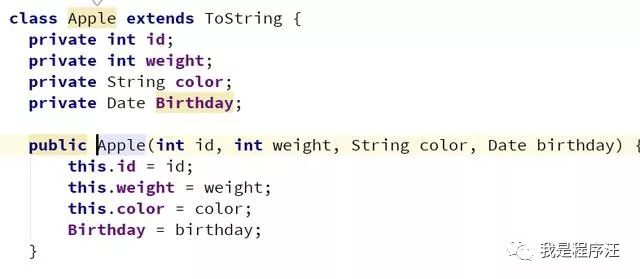
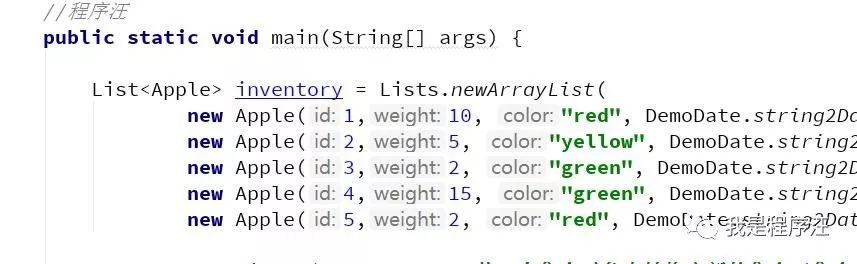
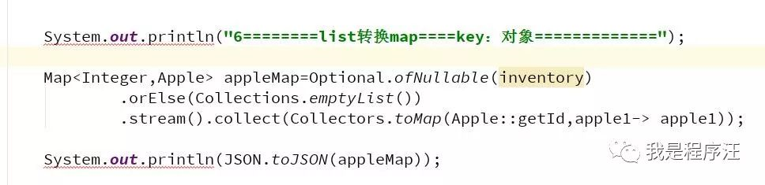
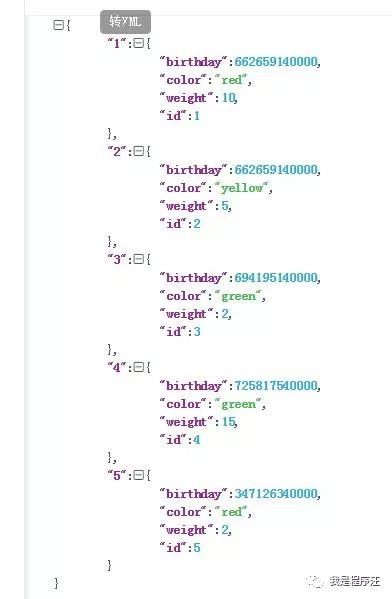
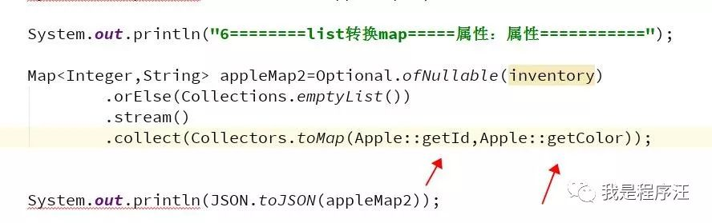
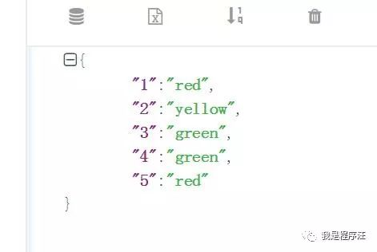
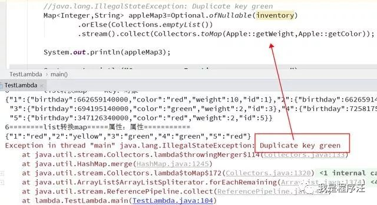
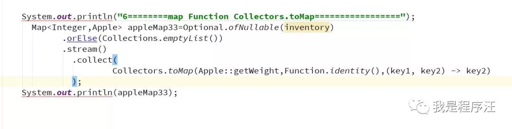
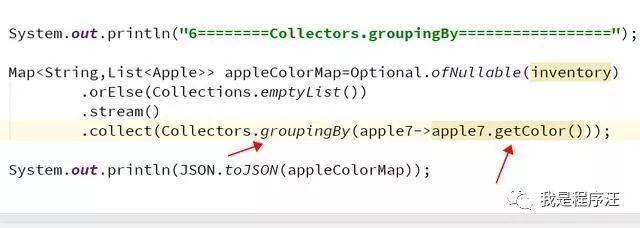
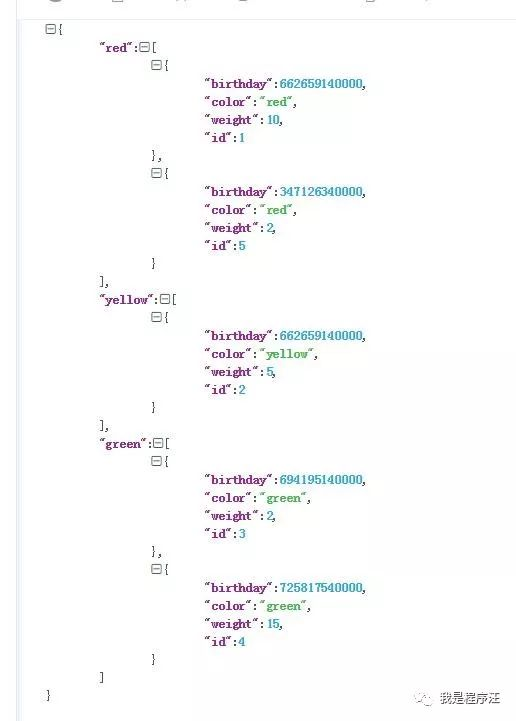

java8函数式语法，程序汪的建议都是多写多写

写多了自然就看顺眼了

学起来吧

# 

# **吐槽**

list、map的转换变形，

是业务代码中写的最多的，

传统模式需要写一堆代码for循环一个个逻辑判断

非常麻烦并容易出BUG

现在java8函数式代码帮我们封装好了，我们用就可以

相当漂亮，我又可以早写完代码下班罗（加不完的班）

# **数据准备**

# **list转换Map**

- key:value （属性：对象）

- 输出成json格式了方便看

- key:value （属性：属性）

- 注意key重复时可能会异常

- 重复key不异常写法

# **list转换Map然后分组**

根据颜色属性分组Map<String,List<Apple>>

key:value(颜色属性：对象集合)

- 输出结果

