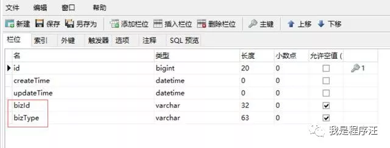
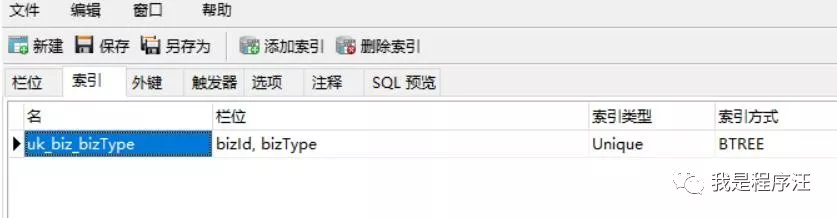
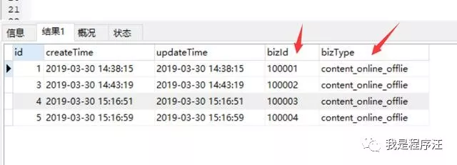
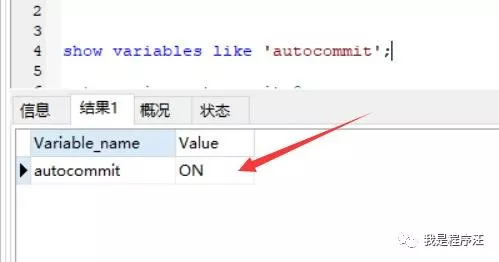
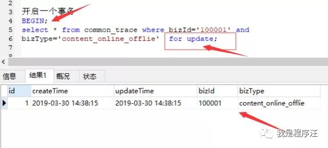
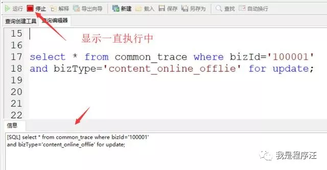

**通俗的理解悲观锁**

乐观锁：门先不锁，有人进来发现不对了在赶出去（有速度，但感觉怕怕的，真的是很乐观啊）

 

悲观锁：门先锁着，有人进来必须要有钥匙才能进门（感觉很安全，但有点慢）


现在大家大概理解了吧  如 银行转账的场景肯定是悲观锁好点，安全第一，慢就慢点嘛；

像大家提交代码svn、git 都是提交后检查有冲突就报异常的，乐观的评估同一个类同时修改他的概率比较小，冲突了代价也不大嘛，解决下冲突在提交嘛；


乐观派“先做在检查”

悲观派“先检查在做”


------

**程序汪下楼梯学习大法**

悲观锁

​         安全

​                 相对乐观慢

​                                   失败代价大

​                                                    不适合高并发

​                                                                         for update【DB锁机制】

​                                                                                                                有死锁风险

------

乐观锁

​           速度

​                   失败代价低

​                                     冲突概率小的场景

​                                                                适合并发

​                                                                               version+1【数据本本】

​                                                                                                  

  

互联网级的大并发采用分布式缓存锁

悲观锁还是乐观锁你比较在一个事务内操作业务才有效果


**没有锁会有什么后果**

1. 脏数据
2. 明明库存是1的，并发后变-1了
3. 明明账户只有100元，并发提现导致提现了200元 （可怕啊）
4. 代码提交被其他人覆盖了 （程序员最伤心的事情）
5. 锁的是安全，防住并发带来的不安全问题

------

**乐观锁具体案例**

 

# **吐槽**

程序员汪进新公司

开发业务代码，类似某内容的上下线功能

忘记考虑高并发场景

导致生产出现了脏数据

解决方案最简单粗暴的就是mysql的悲观锁，这里写不谈其他锁，如缓存锁、乐观锁等等。

mysql的锁其实分很多种，我这里就讲了最简单的应用场景


# **基础准备**

- 多线程
- 高并发
- 串行锁
- mysql行锁

# 先从mysql层面分析案例

先创建一张表



唯一索引




初始化数据

注意bizType就是定义的枚举值类型，bizId就是内容的ID

如内容上下线必须**加串行锁来防止并发**




注意我把MySQL调整成需要手动提交事务

set session autocommit=0; 就这行命令搞定



窗口1开启一个事务begin

窗口1开启一个事务begin



我打开另一个窗口2，执行相同的SQL

会发现一直执行中



当窗口1提交COMMIT后，窗口2才能继续执行完成。

# 总结

- 利用mysql的for update悲观锁来防并发，简单有效
- for update 切记后面要是索引的查询条件，如上唯一索引
- 业务代码中切记在事务代码中去操作
- 特别是审批业务，都必须考虑并发情况
- 这里先不谈其他锁


伪代码如下，特别注意是在同一个事务里

```
java代码
串行锁防并发
    事务开启
    select XXX where 唯一索引 for udpate
     初次调用需要 insert 这个common_trace表
      //TODO 其他业务DB操作
事务提交
```

使用 select…for update 会把数据给锁住，不过我们需要注意一些锁的级别，MySQL InnoDB默认行级锁。行级锁都是基于索引的，如果一条SQL语句用不到索引是不会使用行级锁的，会使用表级锁把整张表锁住，这点需要注意。