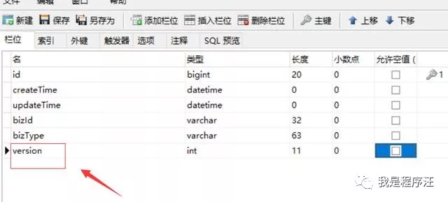
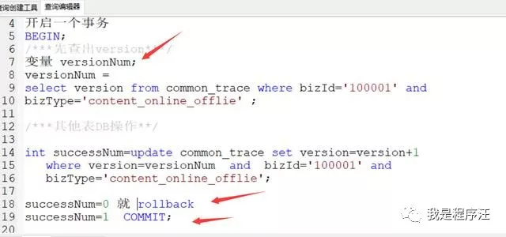
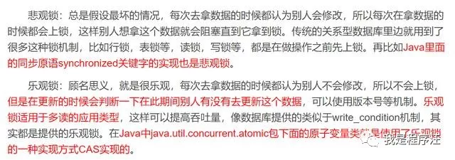

**通俗的理解**

乐观锁：门先不锁，有人进来发现不对了在赶出去（有速度，但感觉怕怕的，乐观锁）

 

悲观锁：门先锁着，有人进来必须要有钥匙才能进门（感觉很安全，但有点麻烦）

# **吐槽**

面试官：什么是乐观锁请举例

程序员：瑟瑟发抖 不懂啊

# **基础准备**

- 乐观锁
- 并发操作
- MYSQL
- 

我以为举过悲观锁案例，大家可以先看看这篇

悲观锁具体案例

#  

# 具体案例

**乐观锁CAS(Compare and Swap 比较并交换)**

MYSQL

现在创建一张表，注意version版本字段，乐观锁就是靠这个字段

下面业务代码一般是这样的

开启一个事务

第一步，把第一次查询出来的version值获取可能是1也可能是10

其他DB操作完毕后

最后一步把第一步查询到的version值，赋值到where version=version值

然后update如果成功，committ提交事务

如果update数据影响行为0，事务失败必须rollback

特别注意在同一个事务内操作的

#  

# **乐观锁用来防并发（2个线程同时执行）**

上面例子如果一个线程进来执行中，

另一个线程刚好也进来执行中

提交时一个版本号已经变更了，另一个版本号肯定更新会失败

防并发其实还有其他方案队列、缓存锁等等 这里先不谈

# 总结

- 乐观锁防并发也是个不错的方案
- 乐观锁经典是SVN、GIT这样的版本控制工具
- **乐观锁宽入严出**

# 悲观锁乐观锁比较

- 乐观锁防并发会异常提示，悲观锁会等待除非超时才会异常
- 乐观锁是非阻塞算法，悲观锁是阻塞算法
- **悲观锁用的不好容易死锁**，乐观锁用的不好结果就不可预期
- 悲观锁的并发访问性不好
- 乐观锁加锁的时间要比悲观锁短，性能完胜悲观锁（加锁时间看）
- 乐观锁看作是关于**冲突检测**的，那么悲观锁就是**冲突避免**
- 冲突很少，或冲突**后果不会很严重**，那么通常应该选择乐观锁，因为它能得到更好并发性，而且更容易实现
- 冲突结果对于用户来说**痛苦的**，那么就需要使用悲观策略，如转账业务

- 
  发现**失败太迟的代价会很大**，就不要用乐观锁程序员专家欢迎来喷，指出我的问题

**乐观锁关键总结（不难理解但要用对地方）**

1. 表设计version字段
2. 加事务，在事务内操作 version=version+1
3. 选择合适场景使用乐观锁
4. 业务例子工单提交，防止其他人并发提交，走乐观锁