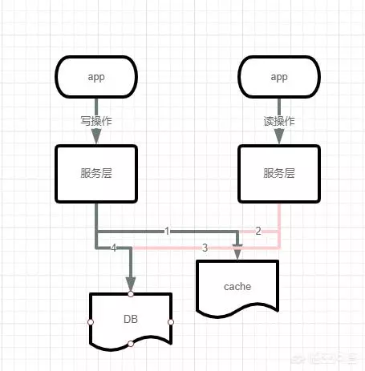
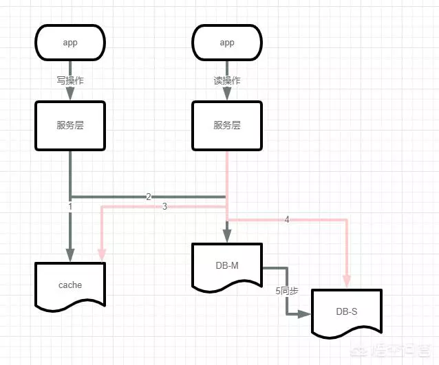
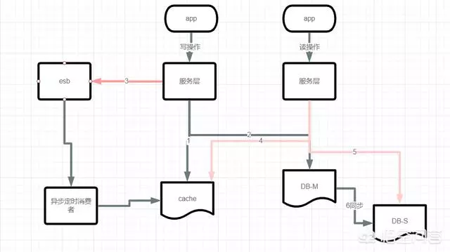
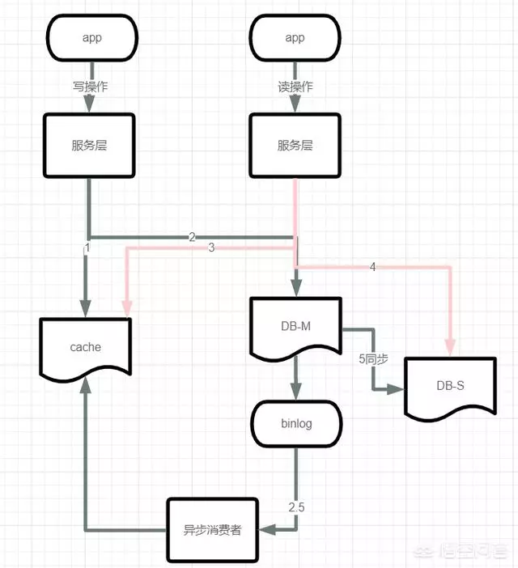

吐槽

程序汪发现[如何解决Redis缓存和MySQL数据一致性的问题？]

互联网公司非常喜欢问这道面试题

因为缓存在互联网公司使用非常频繁

作者： PHP智慧与能力

链接：www.wukong.com/answer/6728954483734216972/

在高并发的业务场景下，数据库的性能瓶颈往往都是用户并发访问过大。所以，一般都使用redis做一个缓冲操作，让请求先访问到redis，而不是直接去访问MySQL等数据库。从而减少网络请求的延迟响应

## 数据为什么会不一致

这样的问题主要是在并发读写访问的时候，缓存和数据相互交叉执行。

一、单库情况下

同一时刻发生了并发读写请求，**例如为A(写) B (读)2个请求**

> 1. A请求发送一个写操作到服务端，第一步会淘汰cache，然后因为各种原因卡主了，不在执行后面业务(例：大量的业务操作、调用其他服务处理消耗了1s）。
>
> 2. B请求发送一个读操作，读cache，因为cache淘汰，所以为空
>
> 3. B请求继续读DB，读出一个脏数据，并写入cache
>
> 4. A请求终于执行完全，在写入数据到DB
>
>    总结：因最后才把写操作数据入DB，并没同步。cache里面一直保持脏数据
>
>    脏数据是指源系统中的数据不在给定的范围内或对于实际业务毫无意义，或是数据格式非法，以及在源系统中存在不规范的编码和含糊的业务逻辑。

**二、主从同步，读写分离的情况下，读从库而产生脏数据**

> 1. A请求发送一个写操作到服务端，第一步会淘汰cache
>
> 2. A请求写主数据库，写了最新的数据。
>
> 3. B请求发送一个读操作，读cache，因为cache淘汰，所以为空
>
> 4. B请求继续读DB，读的是从库，此时主从同步还没同步成功。读出脏数据，然后脏数据入cache
>
> 5. 最后数据库主从同步完成
>
>    总结：这种情况下请求A和请求B操作时序没问题，是主从同步的时延问题(假设1s)，导致读请求读取从库读到脏数据导致的不一致

**根本原因:**

单库下，逻辑处理中消耗1s。可能读到旧数据入缓存

主从+读写分离，在1s的主从同步时延中。读到从库的旧数据入缓存

## 数据优化方案

**一、缓存双淘汰法**

1. 先淘汰缓存
2. 再写数据库
3. 往消息总线esb发送一个淘汰消息，发送立即返回。写请求的处理时间几乎没有增加，这个方法淘汰了缓存两次。因此被称为“缓存双淘汰法“，而在消息总线下游，有一个异步淘汰缓存的消费者，在拿到淘汰消息在1s后淘汰缓存，这样，即使在一秒内有脏数据入缓存，也能够被淘汰掉。

**二、异步淘汰缓存**

上述的步骤，都是在业务线里面执行，新增一个线下的读取binlog异步淘汰缓存模块，读取binlog总的数据，然后进行异步淘汰。

1.思路：

MySQL binlog增量发布订阅消费+消息队列+增量数据更新到redis

1）读请求走Redis：热数据基本都在Redis

2）写请求走MySQL: 增删改都操作MySQL

3）更新Redis数据：MySQ的数据操作binlog，来更新到Redis

2.Redis更新

1）数据操作主要分为两块：

- 一个是全量(将全部数据一次写入到redis)
- 一个是增量（实时更新）

这里说的是增量,指的是mysql的update、insert、delate变更数据。

这样一旦MySQL中产生了新的写入、更新、删除等操作，就可以把binlog相关的消息推送至Redis，Redis再根据binlog中的记录，对Redis进行更新。就无需在从业务线去操作缓存内容

如有感悟，欢迎关注和交流探讨额