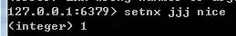
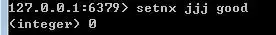
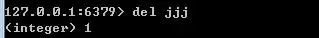

作者： Java高级互联网架构

链接：toutiao.com/i6712700349045539342/

- 一、常规锁会造成什么情况？
- 二、分布式锁怎么去处理？
- 三、分布式锁的实现有哪些？
- 四、在Zookeeper中如何加锁？

------

首先，分布式锁和我们平常讲到的锁原理基本一样，目的就是确保在多个线程并发时，只有一个线程在同一刻操作这个业务或者说方法、变量。

在一个进程中，也就是一个jvm或者说应用中，我们很容易去处理控制，在jdk java.util并发包中已经为我们提供了这些方法去加锁，比如synchronized关键字或者Lock锁，都可以处理。

但是我们现在的应用程序如果只部署一台服务器，那并发量是很差的，如果同时有上万的请求，很有可能造成服务器压力过大而瘫痪。

想想双十一和大年三十晚上十点，瓜分支付宝红包等业务场景，自然需要用到多台服务器去同时处理这些业务，这些服务可能会有上百台同时处理。

但是我们想一想，如果有100台服务器要处理分红包的业务，现在假设有1亿的红包，1千万个人分，金额随机

那么这个业务场景下，是不是必须确保这1千万个人最后分的红包金额总和等于1亿？

如果处理不好，每人分到100万，那马云爸爸估计大年初一，就得宣布破产了

# 一、常规锁会造成什么情况？

首先说一下我们为什么要搞集群。

简单理解就是，需求量（请求并发量）变大了，一个工人处理能力有限，那就多招一些工人来一起处理。

假设1千万个请求平均分配到100台服务器上，每个服务器接收10w的请求。这10w个请求并不是在同一秒中来的，可能是在1,2个小时内

可以联想下我们三十晚上开红包，等到10：20开始，有的人立马开了，有的人等到12点才想起来。

那这样的话，平均到每一秒上的请求也就不到1千个，这种压力一般的服务器还是可以承受的。

- 第一个用户来分，请求到来后，需要在1亿里面给他分一部分钱，金额随机，假设第一个人分到了100，那就要在这1亿中减去100块，剩下99999900块~
- 第二个用户再来分，金额随机，这次分200块，那就需要在剩下的99999900块中再减去200块，剩下99999700块
- 等到第10w个用户来，一看还有1000w，那这1000w全成他的了。

等于是在每个服务器中去分1亿，也就是10w个用户分了一个亿，最后总计有100个服务器，要分100亿。

如果真这样了，虽说马云爸爸不会破产（据最新统计马云有2300亿人民币），那分红包的开发项目组，以及产品经理，可以GG了~

简化结构图如下：

# 二、分布式锁怎么去处理？

那么为了解决这个问题，让1000万用户只分1亿，而不是100亿，这个时候分布式锁就派上用处了。

分布式锁可以把整个集群就当作是一个应用一样去处理，那么也就需要这个锁独立于每一个服务之外，而不是在服务里面。

假设第一个服务器接收到用户1的请求后，不能只在自己的应用中去判断还有多少钱可以分了，而需要去外部请求专门负责管理这1亿红包的人（服务），问他：哎，我这里要分100块，给我100。

管理红包的妹子（服务）一看，还有1个亿，那好，给你100块，然后剩下99999900块。

第二个请求到来后，被服务器2获取，继续去询问，管理红包的妹子，我这边要分10块，管理红包的妹子先查了下还有99999900，那就说：好，给你10块。那就剩下99999890块。

等到第1000w个请求到来后，服务器100拿到请求，继续去询问，管理红包的妹子，我要100，妹子翻了翻白眼，对你说，就剩1块了，爱要不要，那这个时候就只能给你1块了（1块也是钱啊，买根辣条还是可以的）。

这些请求编号1,2不代表执行的先后顺序，正式的场景下，应该是100台服务器每个服务器持有一个请求去访问负责管理红包的妹子（服务）

那在管红包的妹子那里同时会接收到100个请求，这个时候就需要在负责红包的妹子那里加个锁就可以了（抛绣球），你们100个服务器谁拿到锁（抢到绣球），谁就进来和我谈，我给你分，其他人就等着去吧。

经过上面的分布式锁的处理后，马云爸爸终于放心了，决定给红包团队每人加一个鸡腿。

简化的结构图如下：

# 三、分布式锁的实现有哪些？

说到分布式锁的实现，还是有很多的，有数据库方式的，有Redis分布式锁，有Zookeeper分布式锁等等。

我们如果采用Redis作为分布式锁，那么上图中负“责红包的妹子（服务）”，就可以替换成Redis，请自行脑补。

**1、为什么Redis可以实现分布式锁？**

首先Redis是单线程的，这里的单线程指的是网络请求模块使用了一个线程（所以不需考虑并发安全性），即一个线程处理所有网络请求，其他模块仍用了多个线程。

在实际的操作中过程大致是这样子的：

服务器1要去访问发红包的妹子，也就是Redis，那么他会在Redis中通过"setnx key value" 操作设置一个key进去

value是啥不重要，重要的是要有一个key，也就是一个标记，而且这个key你爱叫啥叫啥，只要所有的服务器设置的key相同就可以。

假设我们设置一个，如下图：

那么我们可以看到会返回一个1，那就代表了成功。

如果再来一个请求去设置同样的key，如下图：

这个时候会返回0，那就代表失败了。

那么我们就可以通过这个操作去判断是不是当前可以拿到锁，或者说可以去访问“负责发红包的妹子”

如果返回1，那我就开始去执行后面的逻辑，如果返回0，那就说明已经被人占用了，我就要继续等待。

当服务器1拿到锁之后，进行了业务处理，完成后，还需要释放锁，如下图所示：

删除成功返回1，那么其他的服务器就可以继续重复上面的步骤去设置这个key，以达到获取锁的目的。

当然以上的操作是在Redis客户端直接进行的，通过程序调用的话，肯定就不能这么写，比如java就需要通过jedis去调用，但是整个处理逻辑基本都是一样的。

通过上面的方式，我们好像是解决了分布式锁的问题，但是想想还有没有什么问题呢？

对，问题还是有的，可能会有死锁的问题发生，比如服务器1设置完之后，获取了锁之后，忽然发生了宕机。

那后续的删除key操作就没法执行，这个key会一直在Redis中存在，其他服务器每次去检查，都会返回0，他们都会认为有人在使用锁，我需要等。

为了解决这个死锁的问题，我们就需要给key设置有效期了。

设置的方式有2种：

- 第一种就是在set完key之后，直接设置key的有效期 "expire key timeout" ，为key设置一个超时时间，单位为second，超过这个时间锁会自动释放，避免死锁。

这种方式相当于，把锁持有的有效期，交给了Redis去控制。如果时间到了，你还没有给我删除key，那Redis就直接给你删了，其他服务器就可以继续去setnx获取锁。

- 第二种方式，就是把删除key权利交给其他的服务器，那这个时候就需要用到value值了
- 比如服务器1，设置了value也就是timeout为当前时间+1秒 ，这个时候服务器2通过get发现时间已经超过系统当前时间了，那就说明服务器1没有释放锁，服务器1可能出问题了，服务器2就开始执行删除key操作，并且继续执行setnx操作。

但是这块有一个问题，也就是不光你服务器2可能会发现服务器1超时了，服务器3也可能会发现

如果刚好服务器2 setnx操作完成，服务器3就接着删除，是不是服务器3也可以setnx成功了？

那就等于是服务器2和服务器3都拿到锁了，那就问题大了。这个时候怎么办呢？

这个时候需要用到“GETSET key value”命令了。这个命令的意思就是获取当前key的值，并且设置新的值。

假设服务器2发现key过期了，开始调用getset命令，然后用获取的时间判断是否过期，如果获取的时间仍然是过期的，那就说明拿到锁了。

如果没有，则说明在服务2执行getset之前，服务器3可能也发现锁过期了，并且在服务器2之前执行了getset操作，重新设置了过期时间。

那么服务器2就需要放弃后续的操作，继续等待服务器3释放锁或者去监测key的有效期是否过期。

这块其实有一个小问题，服务器3已经修改了有效期，拿到锁之后，服务器2也修改了有效期，但是没能拿到锁，但是这个有效期的时间已经被在服务器3的基础上有增加一些，但是这种影响其实还是很小的，几乎可以忽略不计。

**2、为什么Zookeeper可实现分布式锁？**

百度百科是这么介绍的：ZooKeeper是一个分布式的，开放源码的分布式应用程序协调服务，是Google的Chubby一个开源的实现，是Hadoop和Hbase的重要组件。

那对于我们初次认识的人，可以理解成ZooKeeper就像是我们的电脑文件系统，我们可以在d盘中创建文件夹a，并且可以继续在文件夹a中创建文件夹a1，a2。

那我们的文件系统有什么特点？那就是同一个目录下文件名称不能重复，同样ZooKeeper也是这样的。

在ZooKeeper所有的节点，也就是文件夹称作Znode，而且这个Znode节点是可以存储数据的。

我们可以通过“ create /zkjjj nice”来创建一个节点，这个命令就表示，在跟目录下创建一个zkjjj的节点，值是nice。同样这里的值，和我在前面说的Redis中的一样，没什么意义，你随便给。

另外ZooKeeper可以创建4种类型的节点，分别是：

- 持久性节点
- 持久性顺序节点
- 临时性节点
- 临时性顺序节点

首先说下持久性节点和临时性节点的区别：

- 持久性节点表示只要你创建了这个节点，那不管你ZooKeeper的客户端是否断开连接，ZooKeeper的服务端都会记录这个节点；
- 临时性节点刚好相反，一旦你ZooKeeper客户端断开了连接，那ZooKeeper服务端就不再保存这个节点；
- 顺便也说下顺序性节点，顺序性节点是指，在创建节点的时候，ZooKeeper会自动给节点编号比如0000001，0000002这种的。

Zookeeper有一个监听机制，客户端注册监听它关心的目录节点，当目录节点发生变化（数据改变、被删除、子目录节点增加删除）等，Zookeeper会通知客户端。

# 四、在Zookeeper中如何加锁？

下面我们继续结合我们上面的分红包场景，描述下在Zookeeper中如何加锁。

假设服务器1，创建了一个节点 /zkjjj，成功了，那服务器1就获取了锁，服务器2再去创建相同的锁，就会失败，这个时候就只能监听这个节点的变化。

等到服务器1处理完业务，删除了节点后，他就会得到通知，然后去创建同样的节点，获取锁处理业务，再删除节点，后续的100台服务器与之类似。

注意这里的100台服务器并不是挨个去执行上面的创建节点的操作，而是并发的，当服务器1创建成功，那么剩下的99个就都会注册监听这个节点，等通知，以此类推。

但是大家有没有注意到，这里还是有问题的，还是会有死锁的情况存在，对不对？

当服务器1创建了节点后挂了，没能删除，那其他99台服务器就会一直等通知，那就完蛋了。。。

这个时候就需要用到临时性节点了，我们前面说过了，临时性节点的特点是客户端一旦断开，就会丢失

也就是当服务器1创建了节点后，如果挂了，那这个节点会自动被删除，这样后续的其他服务器，就可以继续去创建节点，获取锁了。

但是我们可能还需要注意到一点，就是惊群效应：举一个很简单的例子，当你往一群鸽子中间扔一块食物，虽然最终只有一个鸽子抢到食物，但所有鸽子都会被惊动来争夺，没有抢到…

就是当服务器1节点有变化，会通知其余的99个服务器，但是最终只有1个服务器会创建成功，这样98还是需要等待监听，那么为了处理这种情况，就需要用到临时顺序性节点。

大致意思就是，之前是所有99个服务器都监听一个节点，现在就是每一个服务器监听自己前面的一个节点。

假设100个服务器同时发来请求，这个时候会在/zkjjj节点下创建100个临时顺序性节点/zkjjj/000000001，/zkjjj/000000002，一直到/zkjjj/000000100，这个编号就等于是已经给他们设置了获取锁的先后顺序了。

当001节点处理完毕，删除节点后，002收到通知，去获取锁，开始执行，执行完毕，删除节点，通知003~以此类推。