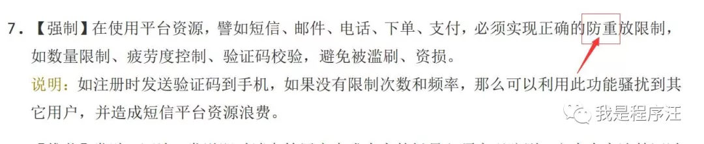
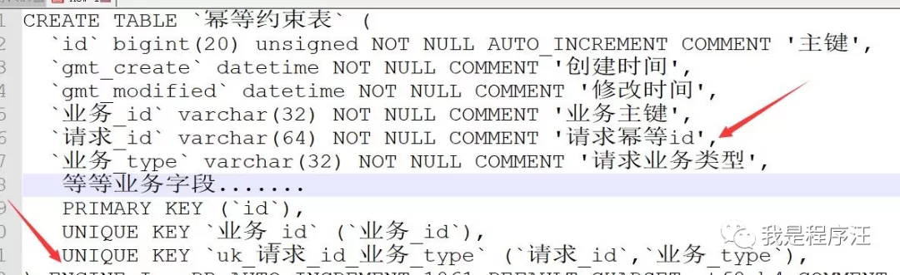

如何你的业务系统经常有脏数据出现

幂等设计肯定出现问题

幂等好专业啊，通俗讲就是防重复

重试后不要重复产生数据（如重复创建工单、支付等等）

幂等手段有很多，这里就讲最常见的数据库层机制（主键约束）

redis缓存锁有空在讲

# 背景

下面是阿里巴巴开发规约的防重规范，可见系统幂等没设计好，后果很严重。在很多高并发系统中，产生重复数据概率非常大，系统必须做好幂等。

幂等：在编程中一个幂等操作的特点是其任意多次执行所产生的影响均与一次执行的影响相同 【百度的专业解释】

# 学习目标

- 学会设计幂等
- 知道什么情况下需要幂等

# 代码例子

幂等主要手段就是通过表中的**唯一约束**实现

程序员们开始学起来-幂等。

# 系统背景

分布式系统如，A【前端输入验证等】-------->B【计算然后入库表数据】

注意我分析的不是传统单机部署的系统。

# 幂等设计1

表中的【请求ID】字段如何设计，一般没有明确幂等条件的话，直接设计成UUID

String uuid = UUID.randomUUID().toString().replace("-", "").toLowerCase();

UUID最少在**3000+年内不会重复**。

# 幂等设计2

有明确幂等条件了，如产品ID不能重复，就可以把【请求ID字段】赋值产品ID

type字段当然是产品操作标识，如产品新增。

具体新增逻辑：

1. 先select幂等表数据是否存在，
2. 然后insert幂等表【高并发下重复数据这里就DB唯一约束异常了】，
3. 然后是具体业务表操作。

幂等就这样完美的实现了。

# 需要幂等场景

- 核心业务数据新增，如电影系统中内容新增；审批流系统多人审批同一数据时，可能导致审批多次。
- 定时任务触发数据生成时，定时任务有时可能重复触发，导致数据生成多次。

在来个案例：定时任务一般是【业务ID+时间维度】当约束条件，如：用户ID+YYYYMMDD，用户每小时执行某业务逻辑。这样相同时间段内不可能有相同数据任务入库了。

# 什么情况会发多次相同数据

- 【系统重试导致】分布式系统下，上游系统有失败重发机制，可能导致数据重复发送
- 【人为导致】多人操作同条数据时，可能导致重复数据。

# 总结

- 关键业务数据**新增操作**时一定要做好幂等，别等到上线了才发现，数据库多了条脏数据。
- 合格的java软件开发工程师必须懂幂等，幂等做好跟脏数据说拜拜。

# 可能被吐槽

- 你select+insert操作即可，一样可以幂等啊【高并发下，这样真防不住】
- 锁和幂等是两个概念，我没一起讲，我有专门讲锁的文章，锁是解决数据一致性问题的。