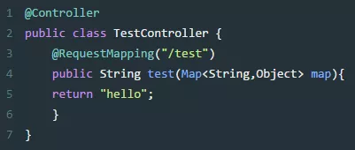
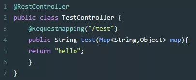
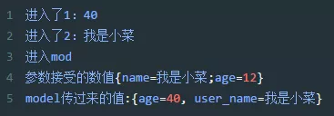
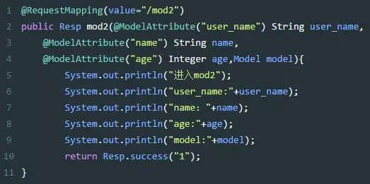
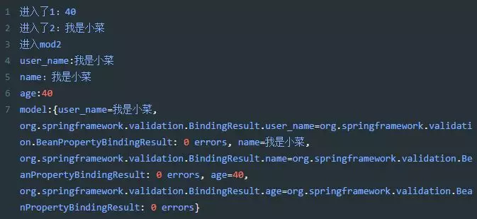
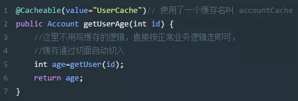
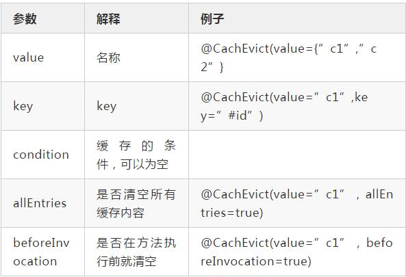
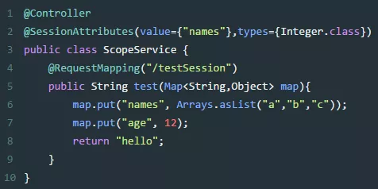

**@Controller**

标识一个该类是Spring MVC controller处理器，用来创建处理http请求的对象.

**@RestController**

Spring4之后加入的注解，原来在@Controller中返回json需要@ResponseBody来配合，如果直接用@RestController替代@Controller就不需要再配置@ResponseBody，默认返回json格式。

**@Service**

用于标注业务层组件，说白了就是加入你有一个用注解的方式把这个类注入到spring配置中

**@Autowired**

用来装配bean，都可以写在字段上，或者方法上。

默认情况下必须要求依赖对象必须存在，如果要允许null值，可以设置它的required属性为false，例如：@Autowired(required=false)

**@RequestMapping**

类定义处: 提供初步的请求映射信息，相对于 WEB 应用的根目录。

方法处: 提供进一步的细分映射信息，相对于类定义处的 URL。

用过RequestMapping的同学都知道，他有非常多的作用，因此详细的用法

我会在下一篇文章专门讲述，请关注公众号哦，以免错过。

**@RequestParam**

用于将请求参数区数据映射到功能处理方法的参数上

例如

这个id就是要接收从接口传递过来的参数id的值的，如果接口传递过来的参数名和你接收的不一致，也可以如下

其中course_id就是接口传递的参数，id就是映射course_id的参数名

**@ModelAttribute**

使用地方有三种：

**1. 标记在方法上。**

> 标记在方法上，会在每一个@RequestMapping标注的方法前执行，如果有返回值，则自动将该返回值加入到ModelMap中。

**A.在有返回的方法上:**

当ModelAttribute设置了value，方法返回的值会以这个value为key，以参数接受到的值作为value，存入到Model中，如下面的方法执行之后，最终相当于 model.addAttribute("user_name", name);假如 @ModelAttribute没有自定义value，则相当于

model.addAttribute("name", name);

**B.在没返回的方法上：**

需要手动model.add方法

我们在当前类下建一个请求方法：

在浏览器中输入访问地址并且加上参数：

http://localhost:8081/api/test/mod?name=我是小菜&age=12

最终输出如下：

**2. 标记在方法的参数上。**

> 标记在方法的参数上，会将客户端传递过来的参数按名称注入到指定对象中，并且会将这个对象自动加入ModelMap中，便于View层使用.我们在上面的类中加入一个方法如下

在浏览器中输入访问地址并且加上参数：

http://localhost:8081/api/test/mod2?name=我是小菜&age=12

最终输出：

从结果就能看出，用在方法参数中的@ModelAttribute注解，实际上是一种接受参数并且自动放入Model对象中，便于使用。

**@Cacheable**

用来标记缓存查询。可用用于方法或者类中，

> 当标记在一个方法上时表示该方法是支持缓存的，当标记在一个类上时则表示该类所有的方法都是支持缓存的。

**参数列表**

比如@Cacheable(value="UserCache") 标识的是当调用了标记了这个注解的方法时，逻辑默认加上从缓存中获取结果的逻辑，如果缓存中没有数据，则执行用户编写查询逻辑，查询成功之后，同时将结果放入缓存中。

但凡说到缓存，都是key-value的形式的，因此key就是方法中的参数（id），value就是查询的结果，而命名空间UserCache是在spring*.xml中定义.

**@CacheEvict**

用来标记要清空缓存的方法，当这个方法被调用后，即会清空缓存。@CacheEvict(value=”UserCache”)

**参数列表**

**@Resource**

@Resource的作用相当于@Autowired

只不过@Autowired按byType自动注入，

而@Resource默认按 byName自动注入罢了。

@Resource有两个属性是比较重要的，分是name和type，Spring将@Resource注解的name属性解析为bean的名字，而type属性则解析为bean的类型。所以如果使用name属性，则使用byName的自动注入策略，而使用type属性时则使用byType自动注入策略。如果既不指定name也不指定type属性，这时将通过反射机制使用byName自动注入策略。

#### **@Resource装配顺序:**

- 如果同时指定了name和type，则从Spring上下文中找到唯一匹配的bean进行装配，找不到则抛出异常
- 如果指定了name，则从上下文中查找名称（id）匹配的bean进行装配，找不到则抛出异常
- 如果指定了type，则从上下文中找到类型匹配的唯一bean进行装配，找不到或者找到多个，都会抛出异常
- 如果既没有指定name，又没有指定type，则自动按照byName方式进行装配；如果没有匹配，则回退为一个原始类型进行匹配，如果匹配则自动装配；

**@PostConstruct**

用来标记是在项目启动的时候执行这个方法。用来修饰一个非静态的void()方法

也就是spring容器启动时就执行，多用于一些全局配置、数据字典之类的加载

被@PostConstruct修饰的方法会在服务器加载Servlet的时候运行，并且只会被服务器执行一次。PostConstruct在构造函数之后执行,init()方法之前执行。PreDestroy（）方法在destroy()方法执行执行之后执

**@PreDestroy**

被@PreDestroy修饰的方法会在服务器卸载Servlet的时候运行，并且只会被服务器调用一次，类似于Servlet的destroy()方法。被@PreDestroy修饰的方法会在destroy()方法之后运行，在Servlet被彻底卸载之前

**@Repository**

用于标注数据访问组件，即DAO组件

**@Component**

泛指组件，当组件不好归类的时候，我们可以使用这个注解进行标注

**@Scope**

用来配置 spring bean 的作用域，它标识 bean 的作用域。

默认值是单例

- singleton:单例模式,全局有且仅有一个实例
- prototype:原型模式,每次获取Bean的时候会有一个新的实例
- request:request表示该针对每一次HTTP请求都会产生一个新的bean，同时该bean仅在当前HTTP request内有效
- session:session作用域表示该针对每一次HTTP请求都会产生一个新的bean，同时该bean仅在当前HTTP session内有效
- global session:只在portal应用中有用，给每一个 global http session 新建一个Bean实例。

**@SessionAttributes**

默认情况下Spring MVC将模型中的数据存储到request域中。当一个请求结束后，数据就失效了。如果要跨页面使用。那么需要使用到session。而@SessionAttributes注解就可以使得模型中的数据存储一份到session域中

**参数：**

1. names：这是一个字符串数组。里面应写需要存储到session中数据的名称。
2. types：根据指定参数的类型，将模型中对应类型的参数存储到session中
3. value：和names是一样的。

**@Required**

适用于bean属性setter方法，并表示受影响的bean属性必须在XML配置文件在配置时进行填充。否则，容器会抛出一个BeanInitializationException异常。

**@Qualifier**

当你创建多个具有相同类型的 bean 时，并且想要用一个属性只为它们其中的一个进行装配，在这种情况下，你可以使用 @Qualifier 注释和 @Autowired 注释通过指定哪一个真正的 bean 将会被装配来消除混乱。