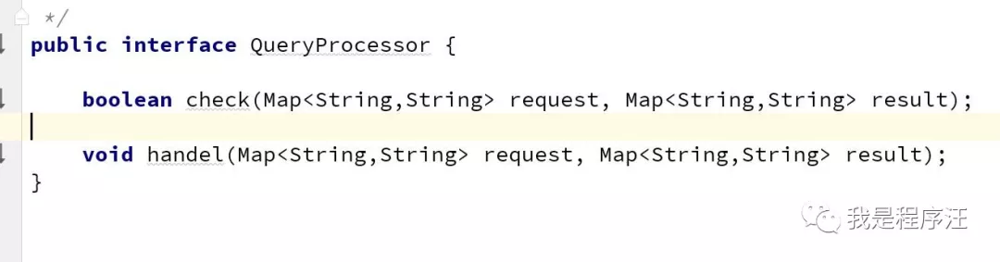
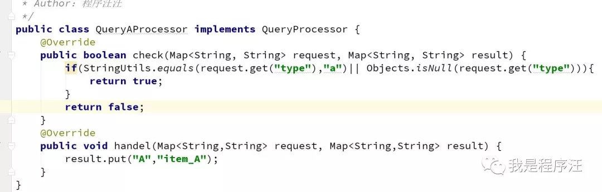
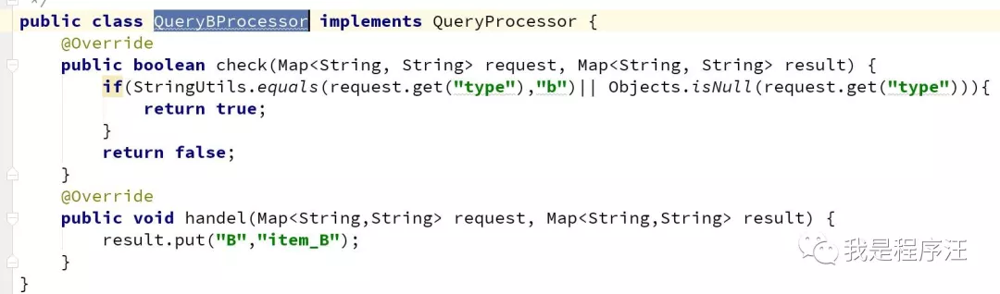
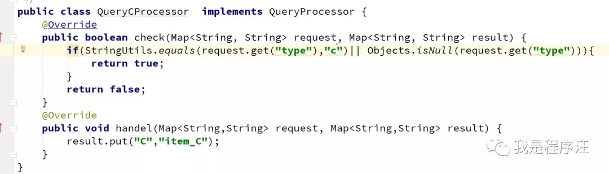
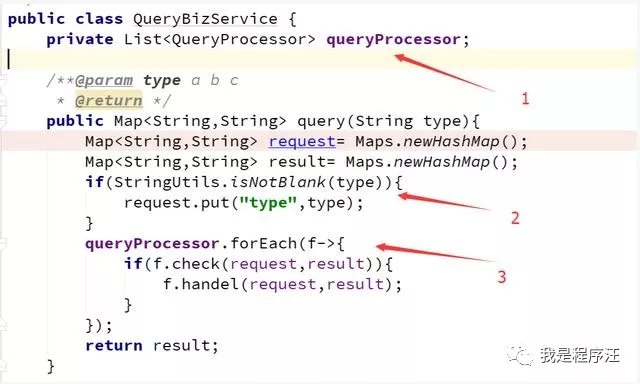
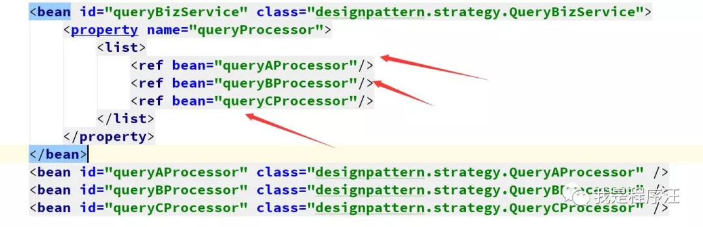
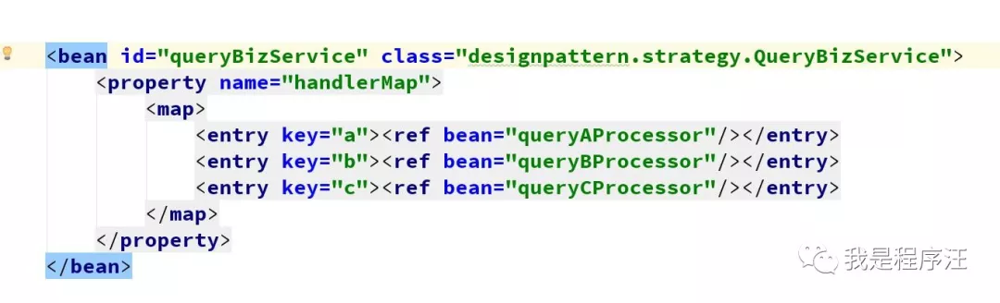
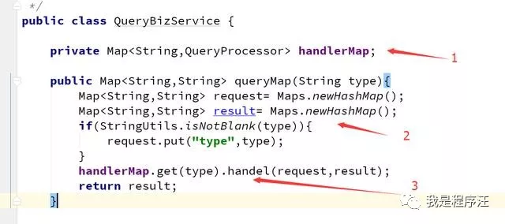
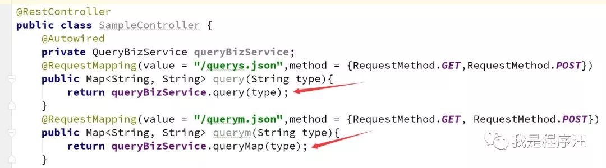

程序汪提醒下面介绍的是项目中实际应用到的策略模式（结合spring）

不是课本上的纯策略模式


# 背景

程序员在项目实战中，策略模式用的非常多。

# 学习目标

- 会在Spring项目中运用策略模式

# 代码例子

废话不多说，java的软件开发们注意啦，开车啦

下面是一个查询业务使用策略模式的案例




查询业务A的具体实现





查询业务B的具体实现





查询业务C的具体实现





# 这是子查询业务的调用类分3部分

- 1.注入list的子查询业务对象
- 2.入参的设置
- 3.循环调用子类，【现验证通过，然后调用处理逻辑】





# Spring配置文件说明

这就是策略模式的应用





# 上面是list的策略模式，还员map的例子

现讲配置文件，很好理解key/value形式。





这是Map策略模式的应用，前面1、2步骤都一样，第3步就不是循环调用了，是单个调用。





# 运行效果

java软件开发，模拟调用





这个url地址是演示效果，动图

https://p9.pstatp.com/large/pgc-image/1532353710975601c452951


源码

```
public interface QueryProcessor {

    boolean check(Map<String,String> request, Map<String,String> result);

    void handel(Map<String,String> request, Map<String,String> result);
}
```


```
public class QueryBProcessor implements QueryProcessor {
    @Override
    public boolean check(Map<String, String> request, Map<String, String> result) {
        if(StringUtils.equals(request.get("type"),"b")|| Objects.isNull(request.get("type"))){
            return true;
        }
        return false;
    }
    @Override
    public void handel(Map<String,String> request, Map<String,String> result) {
        result.put("B","item_B");
    }
}
```


```
public class QueryCProcessor  implements QueryProcessor {
    @Override
    public boolean check(Map<String, String> request, Map<String, String> result) {
        if(StringUtils.equals(request.get("type"),"c")|| Objects.isNull(request.get("type"))){
            return true;
        }
        return false;
    }
    @Override
    public void handel(Map<String,String> request, Map<String,String> result) {
        result.put("C","item_C");
    }
}
```


```
public class QueryBizService {

    private Map<String,QueryProcessor> handlerMap;

    public Map<String,String> queryMap(String type){
        Map<String,String> request= Maps.newHashMap();
        Map<String,String> result= Maps.newHashMap();
        if(StringUtils.isNotBlank(type)){
            request.put("type",type);
        }
        handlerMap.get(type).handel(request,result);
        return result;
    }

    private List<QueryProcessor> queryProcessor;

    /**@param type a b c
     * @return */
    public Map<String,String> query(String type){
        Map<String,String> request= Maps.newHashMap();
        Map<String,String> result= Maps.newHashMap();
        if(StringUtils.isNotBlank(type)){
            request.put("type",type);
        }
        queryProcessor.forEach(f->{
            if(f.check(request,result)){
                f.handel(request,result);
            }
        });
        return result;
    }


    public void setHandlerMap(Map<String, QueryProcessor> handlerMap) {
        this.handlerMap = handlerMap;
    }

    public void setQueryProcessor(List<QueryProcessor> queryProcessor) {
        this.queryProcessor = queryProcessor;
    }
}
```


```
@RestController
public class SampleController {


    @Autowired
    private QueryBizService queryBizService;
    @RequestMapping(value = "/querys.json",method = {RequestMethod.GET,RequestMethod.POST})
    public Map<String, String> query(String type){
        return queryBizService.query(type);
    }
    @RequestMapping(value = "/querym.json",method = {RequestMethod.GET, RequestMethod.POST})
    public Map<String, String> querym(String type){
        return queryBizService.queryMap(type);
    }
    }
```


```
 <!--策略模式应用-->
    <bean id="queryBizService" class="designpattern.strategy.QueryBizService">
        <property name="queryProcessor">
            <list>
                <ref bean="queryAProcessor"/>
                <ref bean="queryBProcessor"/>
                <ref bean="queryCProcessor"/>
            </list>
        </property>
        <property name="handlerMap">
            <map>
                <entry key="a"><ref bean="queryAProcessor"/></entry>
                <entry key="b"><ref bean="queryBProcessor"/></entry>
                <entry key="c"><ref bean="queryCProcessor"/></entry>
            </map>
        </property>
    </bean>

    <bean id="queryAProcessor" class="designpattern.strategy.QueryAProcessor" />
    <bean id="queryBProcessor" class="designpattern.strategy.QueryBProcessor" />
    <bean id="queryCProcessor" class="designpattern.strategy.QueryCProcessor" />
```

