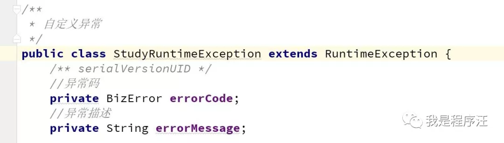
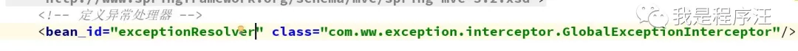
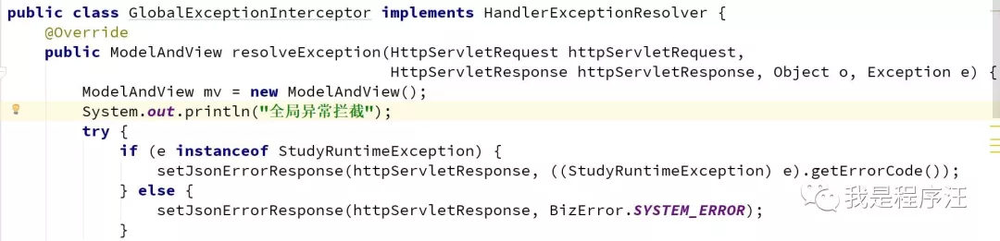
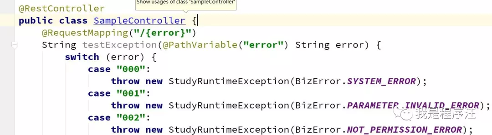
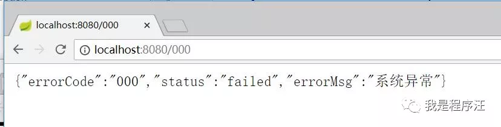
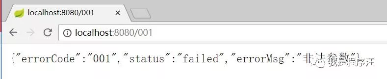

# 背景

在springmvc的controller中程序员经常要封装错误对象返回给前端，前端好显示错误文案。通过spring的异常处理器，可以彻底干净的消灭异常对象的样板代码，设计思路非常好。

# 学习目标

- 学习全局异常拦截器处理controller所有异常的返回封装
- 定义枚举异常码，优雅的设计自定义异常

# 经典案例

--------------创建枚举异常码，系统所有异常情况在这里定义就是--------------------异常码

-------------------程序员，在系统中定义一个异常就够了，通过异常码区分具体异常，这种方式非常优雅--------------

自定义异常

具体异常拦截逻辑，代码非常简单，学习下这种设计思路，优雅减少项目样板代码

1. 通过异常instanceof判断出自定义异常，
2. 然后取出异常码，通过json方式返回给前端

还有个配置

异常处理器

具体拦截逻辑，程序员们注意了------

拦截器实现

------软件开发设计demo----------------

controller

--------测试效果---------程序员--------------

000

001