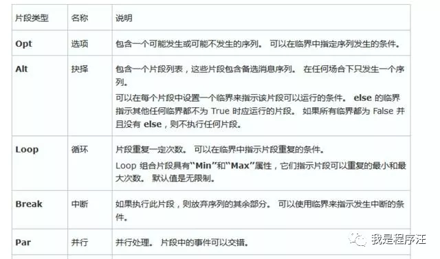
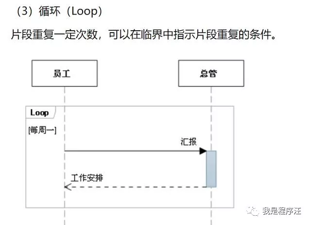

# **吐槽**

面试官：SpringMVC的UML时序图给我画下

程序汪：什么图，不会啊（已经慌了）

面试官：你可以回家等消息了

# springmvc时序图

**核心类与接口**

\- DispatcherServlet 前置控制器

\- HandlerMapping 请求映射（到Controller）

\- HandlerAdapter 请求映射（到Controller类的方法上）

\- Controller 控制器

\- HandlerIntercepter 拦截器

\- ViewResolver 视图映射

\- View 视图处理

# UML时序图

# Alt

Alt片段组合可以理解为if..else if...else条件语句。

相当于经典的**if..else..**

注意else没逻辑，就是空的

例子

# LOOP

# par并行

例子2

# 在看个案例

# Opt

1

# 推荐工具

