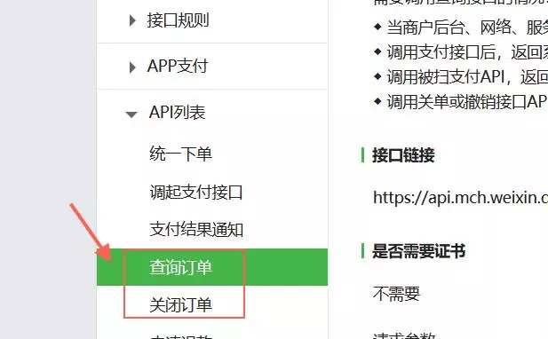
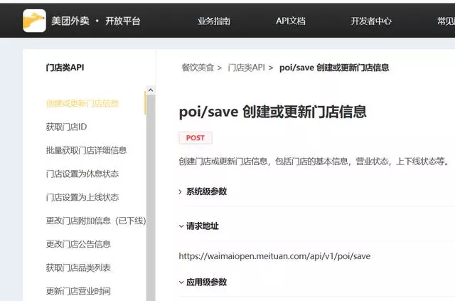
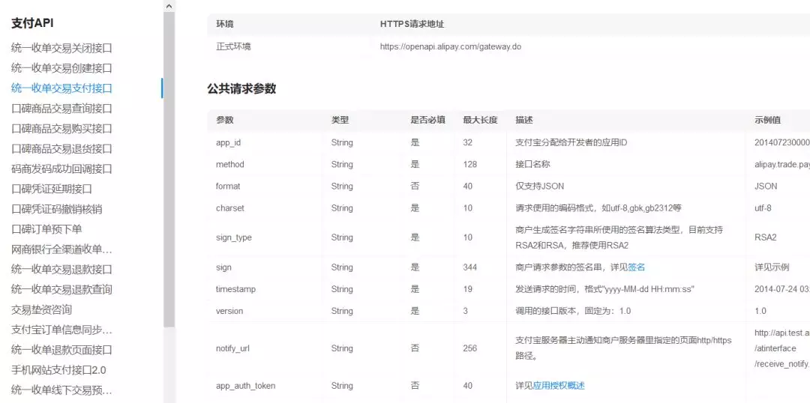
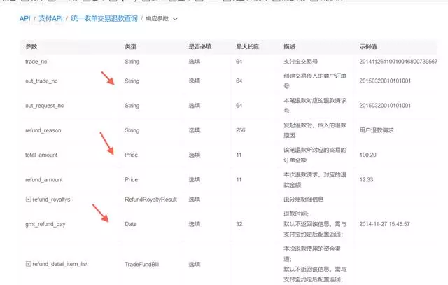
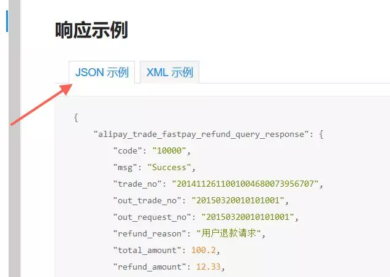
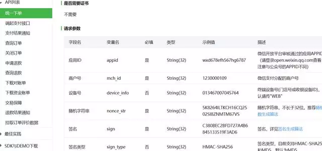

**吐槽**

程序汪举的是微信的例子

个人感觉支付宝开发平台接口更加规范点

以后微信相关的开发会越来越多

大家有空多研究下开发平台接口

对自己独立设计接口帮助很大

# 参数资料

**专家的API设计案例哪里找，程序员们看下面**

- 微信开发平台API

- 美团外卖开发平台接口
- 

**支付宝开发平台接口**

# **1， 接口参数类型定义**

避免滥用String,

如日期类型就应该用Date，钱就用Money(自定义的类型)

复杂字段不要定义Map<String,String>尽量多创建DTO来描述复杂模型

很多接口程序员图简单快，上来就是Map搞定。

# **2， 接口新模型**

必须多考虑，优先使用现有的模型（DTO），

如果需要新增，则模型的字段需要延续业务已经有的标准

（如：电影实例的字段需要和电影模板的一致）

所以新进一个项目组必须尽快熟悉目前的接口业务，很多接口能力本来就有了，然后你不熟悉导致又增加冗余接口。

# **3， 接口需要满足原子性**

满足原子性，避免有二义

如查询并购买电影票，就不具备原子性

如微信API，如果搞个查询并关闭订单，这就不具备原子性

# **4 ，接口输出模型职能匹配**

职能匹配，不能有接口边界不清楚，

如查看电影票接口，返回了电影优惠券，

就会导致接口边界不清楚

# **5，尽量复用现有接口能力**

如查询电影数据接口，本身电影只支持查询未被删除的电影，

突然PD提出需要查询已经删除的电影数据，这个时候不是马上新开一个接口

而是在原来接口DTO上增加区分是否删除的属性去控制，

后端SQL就通过DTO的删除属性去动态拼接SQL条件

# **6，接口参数模型嵌套不要太深**

建议不要超过5层，尽量平铺

# **7，接口推荐用json格式**

json简单速度快，推荐使用

# 微信开发平台（API接口）

大家设计接口可以去看看微信、支付宝的开发平台API接口怎么设计的

程序汪分享了大量面经，大家可以看看，感谢粉丝的提供